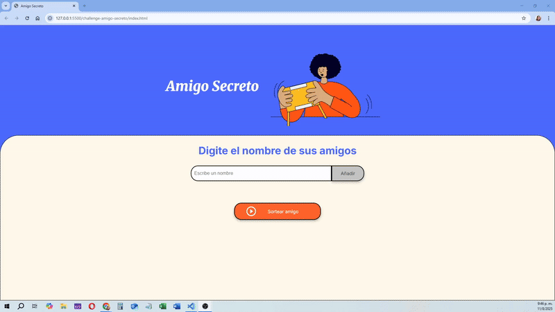

# 🎁 Challenge Amigo Secreto

Esta aplicacion forma parte del Challenge º1 del curso Oracle/Alura Next Education. La logica fue desarrollada en Javascript.

Es una aplicación web sencilla y divertida para organizar sorteos de amigo secreto. Esta pensado para sortear amigos secretos el mismo dia de la entrega del regalo.

# Descripcion e indicaciones

- Los usuarios pueden ingresar nombres de participantes y realizar el sorteo de forma aleatoria.

- Si el usuario intenta agregar un campo vacio se le mostrara una alerta.

- Si ingresa un valor valido se ira agregando a la lista y se mostrara en pantalla.

- Al seleccionar "Sortear amigo", se tomara un nombre de la lista de manera aleatoria y se mostrara en pantalla. Se puede seleccionar el boton tantas veces como nombres tenga la lista

- Cada que salga sorteado un nombre, el mismo no volvera a salir sorteado a no ser que se agregue nuevamente a la lista

- Si selecciona Sortear amigo, y no quedan nombres en la lista, se mostrara una alerta

## 📸 Vista previa

